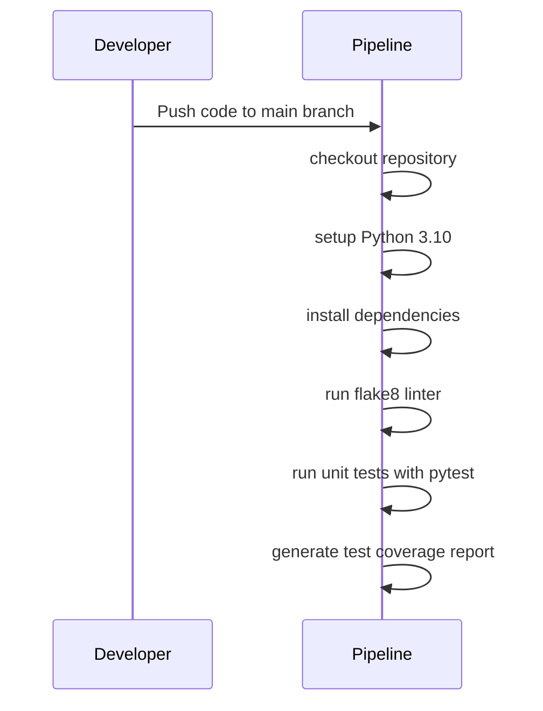
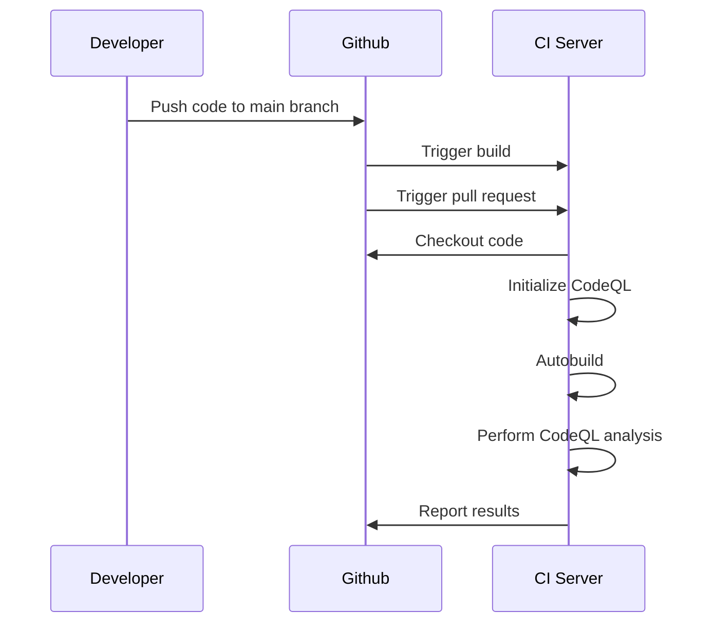

```mermaid
sequenceDiagram
    participant Developer
    participant Pipeline
    Developer->>Pipeline: Push code to main branch
    Pipeline->>Pipeline: checkout repository
    Pipeline->>Pipeline: setup Python 3.10
    Pipeline->>Pipeline: install dependencies
    Pipeline->>Pipeline: run flake8 linter
    Pipeline->>Pipeline: run unit tests with pytest
    Pipeline->>Pipeline: generate test coverage report
```

```mermaid
sequenceDiagram
participant Developer
participant Github
participant CI Server

Developer->>Github: Push code to main branch
Github->>CI Server: Trigger build
Github->>CI Server: Trigger pull request
CI Server->>Github: Checkout code
CI Server->>CI Server: Initialize CodeQL
CI Server->>CI Server: Autobuild
CI Server->>CI Server: Perform CodeQL analysis
CI Server->>Github: Report results
```
