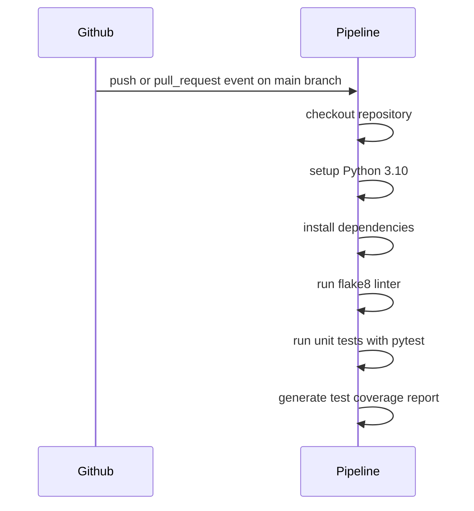

```mermaid
sequenceDiagram
    Github->>Pipeline: push or pull_request event on main branch
    Pipeline->>Pipeline: checkout repository
    Pipeline->>Pipeline: setup Python 3.10
    Pipeline->>Pipeline: install dependencies
    Pipeline->>Pipeline: run flake8 linter
    Pipeline->>Pipeline: run unit tests with pytest
    Pipeline->>Pipeline: generate test coverage report
```
